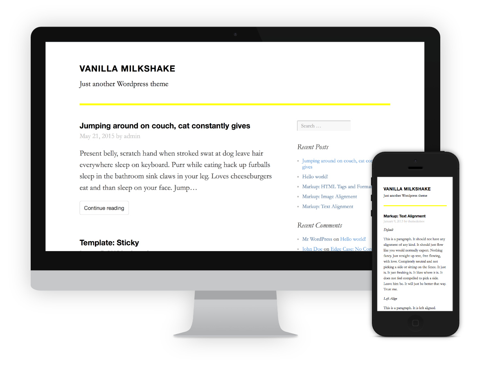

# Vanilla Milkshake #

A minimalist WordPress theme built with elegant typography and responsive design for simple weblogs. Allows for easy customization and extension.

**[See the theme in action and read about its features on its project page](http://hongkonggong.github.io/vanilla-milkshake/).**

---

### Notes for theme developers ###

- Vanilla Milkshake currently uses the default, WordPress-generated search form. (In case you were wondering where that was.)
- There is a custom, media-rich excerpt function (see inc/rich-excerpt.php), which has been tested with my blog and the theme test blog but may still have a bug or two.
- To build this theme, I used the [Twenty Fifteen](https://github.com/WordPress/WordPress/tree/master/wp-content/themes/twentyfifteen) theme as my starting point, and then stripped out as many custom functions and templates as I deemed reasonable. If something doesn't make sense, it's because it may be a vestige from [Twenty Fifteen](https://github.com/WordPress/WordPress/tree/master/wp-content/themes/twentyfifteen).
- The [Tachyons](https://github.com/mrmrs/tachyons/) CSS framework I use reads a lot like inline HTML and should make sense when you see the HTML templates. The basic philosophy behind it is that cascading styles often try to do too much and cause cascading errors. As such, specifying inline styles in the templates ends up creating cleaner code and better performance. (Also, I used [my own fork of Tachyons](https://github.com/hongkonggong/tachyons).

### Credits ###

- [Twenty Fifteen](https://wordpress.org/themes/twentyfifteen/) theme, which I used as a starting point
- [Tachyons](http://www.tachyons.io) lightning-fast CSS framework
- [Butterick's Practical Typography](practicaltypography.com/), whose advice I followed for system fonts
- [Type scale](http://type-scale.com/), a handy type-sizing tool 
- [unlimited edition](http://web.archive.org/web/20090423123137/http://www.hexaplex.nl/09/unlimited-edition), my former go-to theme for a default, minimalist aesthetic

### License ###

Vanilla Milkshake is released under the terms of the [GNU General Public License version 3](http://www.gnu.org/licenses/gpl.html).
