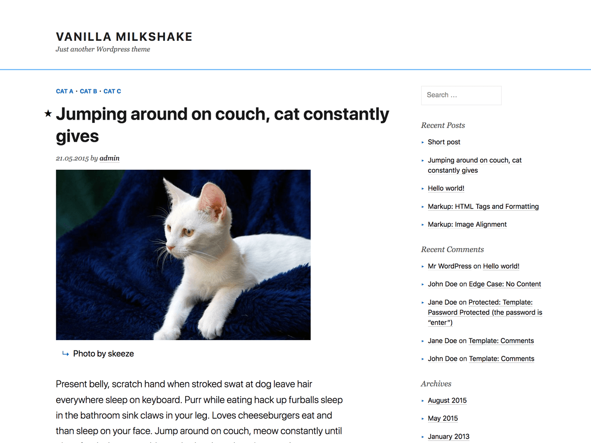

# Vanilla Milkshake

**A minimalist Wordpess theme built with elegant typography and responsive design for simple weblogs. Allows for easy customization and extension.**

## Who this theme is for

- Bloggers who just want a simple yet classic, two-column blog design that works just as well on mobile and tablet then it does on desktop.
- Wordpress theme developers who want a simple base theme with the bare minimum of template files and CSS styles.
- Frontend developers who want to see the [Tachyons](https://github.com/mrmrs/tachyons/) CSS framework in action.

## Theme features

- Responsive design
- Modern typography
- Customizable colors
- Image-friendly excerpts
- Accessibility enhanced
- Translation ready

## See the theme in action

- [88 Bar](http://88-bar.com/): a group blog about Chinese tech, media and design.

## Notes for theme developers

- *tachyons.scss* and *style.scss* actually don't use any SASS syntax; they're simply named such so that Codekit will minify them into *tachyons.css* and *style.css*.
- Vanilla Milkshake currently uses the default, Wordpress-generated search and comment forms. (In case you were wondering where those were.)
- To build this theme, I used the [Twenty Fifteen](https://github.com/WordPress/WordPress/tree/master/wp-content/themes/twentyfifteen) theme as my starting point, and then stripped out as many custom functions and templates as I deemed reasonable. If something doesn't make sense, it's because it may be a vestige from [Twenty Fifteen](https://github.com/WordPress/WordPress/tree/master/wp-content/themes/twentyfifteen).
- The [Tachyons](https://github.com/mrmrs/tachyons/) CSS framework I use reads a lot like inline HTML and should make sense when you see the HTML templates. The basic philosophy behind it is that cascading styles often try to do too much and cause cascading errors. As such, specifying inline styles in the templates ends up creating cleaner code and better performance.

## Credits

The Vanilla Milkshake theme is built on top of the [Twenty Fifteen](https://github.com/WordPress/WordPress/tree/master/wp-content/themes/twentyfifteen) theme, and incorporates a modified version of the [Tachyons](https://github.com/mrmrs/tachyons/) CSS framework.