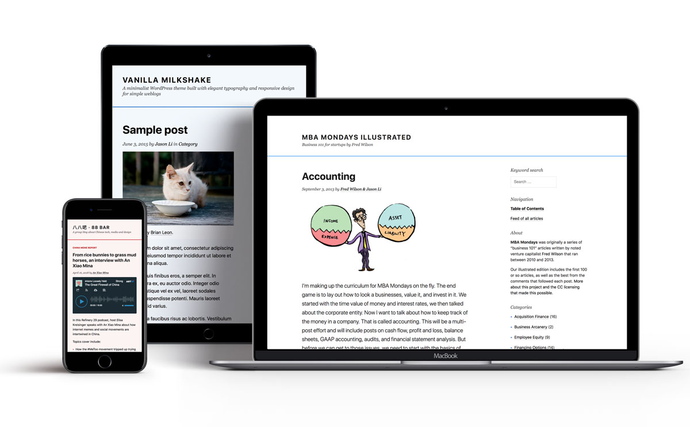

# Vanilla Milkshake #

A minimalist WordPress theme built with elegant typography and responsive design for simple weblogs. Allows for easy customization and extension. Built for the Wordpress [Classic Editor](https://wordpress.org/plugins/classic-editor/), which creates a more distraction-free writing environment.

**[See the theme in action and read about its features on its project page](https://adrawerofthings.github.io/vanilla-milkshake/).**

---

### Notes for theme developers ###

- Vanilla Milkshake currently uses the default, WordPress-generated search form. (In case you were wondering where that was.)
- The custom, media-rich excerpt function (see inc/rich-excerpt.php), which has been tested on several blogs but may still have some quirks/bugs.
- To build this theme, I used the [Twenty Fifteen](https://github.com/WordPress/WordPress/tree/master/wp-content/themes/twentyfifteen) theme as a starting point, and then stripped out as many custom functions and templates as I deemed reasonable. If something seems out of place, it may be a vestige from [Twenty Fifteen](https://github.com/WordPress/WordPress/tree/master/wp-content/themes/twentyfifteen).
- The [Tachyons](https://github.com/tachyons-css/tachyons) CSS framework I use reads a lot like inline HTML - I wrote a little bit [here](https://blog.byjasonli.com/is-tachyons-the-right-css-framework-for-me/) about why that is a good thing. The basic philosophy behind it is that cascading styles often try to do too much and cause cascading errors. As such, specifying inline styles in the templates ends up creating cleaner code and better performance. (Also, I used [the verbose edition of Tachyons](https://github.com/tachyons-css/tachyons-verbose).)

### Credits ###

- [Twenty Fifteen](https://wordpress.org/themes/twentyfifteen/) theme by WordPress, which I used as a starting point
- [Tachyons](http://www.tachyons.io), a lightning-fast, functional CSS framework
- [unlimited edition](http://web.archive.org/web/20090423123137/http://www.hexaplex.nl/09/unlimited-edition), my former go-to theme for a default, minimalist aesthetic

### License ###

Vanilla Milkshake is released under the terms of the [GNU General Public License version 3](http://www.gnu.org/licenses/gpl.html).
